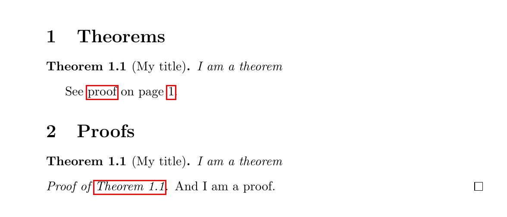

# Proof-at-the-end, or how to move proofs in appendix in LaTeX

WARNING: this package is definitely usable, but may not be as tested and stable as standard packages. Note also that it may change a bit in the future, but we will of course try to avoid as much as possible backward incompatibilities. To ensure your document won't change when the package get updates, it is always safer to copy the `proof-at-the-end.sty` file at the root of your project.

## Introduction

This package aims to provide a way to easily move proofs in the appendix. You can:

- Move proofs in different places/sections by giving different "categories" to the theorems
- Create links from theorem to proof, and from proof to theorem
- Restate the theorem in appendix (or before)
- Keep the proof in the main body like normal theorems by just adding with just one keyword
- Duplicate the proof in appendix and in the current section, practical to use synctex during the proof writting
- Add comments that would appear only in the appendix (or in both body and appendix)
- Move both the theorem and the proof completely in appendix
- Easily change the defaults, and create your own styles/environments
- Include sketch of proof in the main text, and full proof in appendix
- Change the text of the link, for example to translate into another language
- Have a nice environment-based commands in order to mimic the usual theorem/proof structure.


NB: This project is hosted on github at [https://github.com/leo-colisson/proof-at-the-end](https://github.com/leo-colisson/proof-at-the-end) . Feel free to contribute, report bugs, or read/copy-paste the documentation/examples from there.

Disclaimer: This package is still in beta and not considered as stable.

This package is licensed under LPPL v1.3, and the last version of this package on CTAN is 2019/05/21.

## Demo ##

If you just want to see an example of what you can do, you can directly open the file `demo.pdf` (also available online at [https://github.com/leo-colisson/proof-at-the-end/raw/master/demo.pdf](https://github.com/leo-colisson/proof-at-the-end/raw/master/demo.pdf)) to see what is possible, or generate it with

```bash
git clone https://github.com/leo-colisson/proof-at-the-end.git
pdflatex demo.tex && pdflatex demo.tex
```

## Quickstart ##

### Super Quick QuickStart ###

If `proof-at-the-end` it's not installed in your CTAN distribution, copy the [`proof-at-the-end.sty` file](github.com/leo-colisson/proof-at-the-end/) in your project. Then, in your project, create new theorem/lemma environments (using any tool you like, like asmthm, ntheorem and thmtools), load the library using `\usepackage[createShortEnv]{proof-at-the-end}` and write your theorem using:

```latex
\begin{thmE}[My title][end, restate]
  I am a restated theorem whose proof goes in appendix (compile me twice).
\end{thmE}
\begin{proofE}
  And I am a proof.
\end{proofE}
```
The options (here `restate` and `end`) tells what should go in appendix, how to configure the links... Here the proof should go in appendix, and the `restate` options states that the theorem should be restated before the proof.

You can find below a full example to compile which should produce this output (sorry, this is a screenshot):



You can directly copy them (with a more complete demo) in the github page here \url{https://github.com/leo-colisson/proof-at-the-end/}.

```latex
\documentclass{article}

\usepackage{xparse} % Not needed with recent LaTeX
\usepackage{amsthm}

% Create new theorems, or use ntheorem/thmtools/...
\newtheorem{thm}{Theorem}[section]
% Default uses autoref, but you can also use cleveref, see the documentation.
% Say to autoref that "thm" are Theorems.
\newcommand{\thmautorefname}{Theorem}

%% Load the library. createShortEnv automatically creates the shortcuts
%% thmE, theoremE, lemmaE, corrolaryE, proofE. See \newEndThm for more details.
\usepackage[createShortEnv]{proof-at-the-end}

\begin{document}

\section{Theorems}

\begin{thmE}[My title][end]
  I am a theorem
\end{thmE}
\begin{proofE}
  And I am a proof.
\end{proofE}

\section{Proofs}
\printProofs

\end{document}
```


### Install ###

If your CTAN distribution is recent enough, you have nothing to do (if you are using overleaf, note that you can configure your project to use a more recent TexLive distribution: this packages is included starting from TexLive 2019). Otherwise if it's not yet in your CTAN distribution, first download the `proof-at-the-end.sty` file and insert it in the root of your project with the following commands on unix (you can also clone this repository if you prefer, or just manually download or copy/paste the files on Windows).

``` bash
cd <your project>
repopratend="https://raw.githubusercontent.com/leo-colisson/proof-at-the-end"
wget ${repopratend}/master/proof-at-the-end.sty
```

It also requires a recent version of xparse (not present in TexLive 2018 and before basically), otherwise you will get an error like:

```
Unknown argument type 'b' replaced by 'm'
```

While [we used to provide](https://raw.githubusercontent.com/leo-colisson/proof-at-the-end/c2150f4feba4709d47e43c00e5f8eb93ce345cab/xparse.sty) for simplicity a `xparse.sty` file (version `2018-04-12`) in older versions of this repository, we removed it to [avoid license issues and conflicts with recent LaTeX distributions that already include xparse](https://github.com/leo-colisson/proof-at-the-end/issues/6). Nevertheless, if you are using an older distribution, you can also download `xparse` manually [here](http://mirrors.ctan.org/install/macros/latex/contrib/l3packages.tds.zip), unzip it, and copy the `.sty` files contained in `tex/latex/l3packages/xparse/` at the root of your project. On linux, you can do that via:

``` bash
cd <your project>
wget http://mirrors.ctan.org/install/macros/latex/contrib/l3packages.tds.zip
unzip -d . -j l3packages.tds.zip 'tex/latex/l3packages/xparse/*'
rm -f l3packages.tds.zip xparse.ltx
```

If you have an old distribution of LaTeX (2017 or before basically), you may also need a [more recent expl3](https://tex.stackexchange.com/questions/489646/expl3-and-recent-xparse-on-overleaf-no-expl3-loader-detected/489649?noredirect=1#comment1236409_489649) or you will get an error like:

```
Package xparse Error: Support package l3kernel too old.
```

To install it, download the zip files [http://mirrors.ctan.org/install/macros/latex/contrib/l3kernel.tds.zip](http://mirrors.ctan.org/install/macros/latex/contrib/l3kernel.tds.zip) and [http://mirrors.ctan.org/install/macros/latex/contrib/l3backend.tds.zip](http://mirrors.ctan.org/install/macros/latex/contrib/l3backend.tds.zip) (`l3backend` is [since July 1st, 2019](https://tex.stackexchange.com/questions/499082/file-l3backend-pdfmode-def-not-found-when-loading-expl3) a dependency of l3kernel), unzip, and copy the content of the directories `tex/latex/l3kernel/` (first archive) and `tex/latex/l3backend/` (second archive) into your project. On linux it's a matter of two commands in your project:

```bash
cd <your project>
wget http://mirrors.ctan.org/install/macros/latex/contrib/l3kernel.tds.zip
unzip -d . -j l3kernel.tds.zip 'tex/latex/l3kernel/*'
rm l3kernel.tds.zip
wget http://mirrors.ctan.org/install/macros/latex/contrib/l3backend.tds.zip
unzip -d . -j l3backend.tds.zip 'tex/latex/l3backend/*'
rm l3backend.tds.zip
```

If you don't want to pollute your main project with all these files, you may be interested to put them in a subfolder and update the environment variable `TEXINPUTS` or, if you use latexmk or overleaf, you can write instead a `latexmkrc` file as explained [here](https://www.overleaf.com/learn/latex/Questions/I_have_a_lot_of_.cls,_.sty,_.bst_files,_and_I_want_to_put_them_in_a_folder_to_keep_my_project_uncluttered._But_my_project_is_not_finding_them_to_compile_correctly). 

If you still have errors, it's likely that your LaTeX distribution is just too old (LaTeX 2016 seems to be too old to install a recent l3exp). So just upgrade to a decent version, and you should not have any troubles anymore.

You can test your install by compiling the `demo.tex` file present in the repository. When it compiles, you are ready to start!

### Use in your project ###

Now, you can load the library in your project by simply using:

```latex
\usepackage{proof-at-the-end}
```

Then, you can configure your theorem/lemma/... environments as usual, by using any counter you like...:

```latex
\usepackage{amssymb, amsthm, amsmath}
% Theorems
\newtheorem{thm}{Theorem}[section]
\newtheorem*{thm*}{Theorem}
\providecommand*\thmautorefname{Theorem}
% Lemmata
\newtheorem{lemma}[thm]{Lemma}
\newtheorem*{lemma*}{Lemma}
\providecommand*\lemmaautorefname{Lemma}
```

And inside your document, you can use the following syntax to create a new theorem:

```latex
\begin{theoremEnd}[OPTIONS]{THEOREM ENVIRONMENT}[OPTIONAL TITLE]
    YOUR THEOREM, with eventually labels like \label{thm:OPTIONAL LABEL}
\end{theoremEnd}
\begin{proofEnd} %% Optional environment
    YOUR (OPTIONAL) PROOF
\end{proofEnd}
```

For example:

```latex
\begin{theoremEnd}{thm}[Yes I can have a title]
  \label{thm:ilikelabels}
  Creating a new theorem is easy
\end{theoremEnd}
\begin{proofEnd}
  You want a proof? Here is it!
\end{proofEnd}
```

And put in the place where you would like to display the theorem the following code:

```latex
\printProofs
```

If you would like to display a lemma instead, just change `{thm}` into `{lemma}`, or into any other theorem environment you defined! You can now compile safely your document ;)

NB: if you want to make sure all the references are linked correctly, make sure to compile twice the document!


Isn't it simple ?


### A note on `hyperref`

An older version of the package explicitely loaded `hyperref` with no option, and an option clash could occur if the user wanted to add options to `hyperref`. We now push the loading to the very end to avoid that issue, but if you want to load packages *after* `hyperref` (like `cleveref`), it is your job to include `hyperref`, for example by putting at the end of the preambule something like:

```latex
\usepackage[colorlinks]{hyperref}
\usepackage{cleveref}
```

## Use cases

### Configuration and how to use and create styles ###

You can very easily configure this package, and choose how each theorem/proof must be displayed by providing a value in `OPTIONS`. For example, if you would like to keep the proof of a theorem in the main text like any normal theorem, use the `normal` option:

```latex
\begin{theoremEnd}[normal]{thm}[A title]
  You can easily turn a theorem back into a normal theorem!
\end{theoremEnd}
\begin{proofEnd}
  And keep the proof with you!
\end{proofEnd}
```

The options are in fact a set of keys/values, thanks to `pgfkeys`. So you can combine them with comma separated list like that (order matters, as the right-most values may overwrite configuration set by left-most values):

```latex
\begin{theoremEnd}[proof at the end,
                   no link to proof,
                   text proof={Difficult proof}
                  ]{thm}[A title]
  Each theorem can have a custom configuration!
\end{theoremEnd}
\begin{proofEnd}
  Quite practical, isn't it?
\end{proofEnd}
```

You can easily create your own styles like that:

```latex
\pgfkeys{/prAtEnd/my great style/.style={
    proot at the end,
    no link to proof,
    text proof={Difficult proof},
  }
}
```

You can also change the default configuration when you load the package by nesting the configuration into a `conf` key:

```latex
\usepackage[conf={normal, one big link}]{proof-at-the-end}
```

Note however that for now it is *not* possible to use macros directly inside the options when you load the package, so if you need to use more complicated configuration, you can overwrite the `global custom defaults` style for global configuration, and the `local custom defaults` style for local configuration (useful for example if you want to define a category for a single section):

```latex
\pgfkeys{/prAtEnd/global custom defaults/.style={
    one big link={Go to proof on page~\pageref*{proof:prAtEnd\pratendcountercurrent}}
  }
}
```

and for local configuration:
```latex
\pgfkeys{/prAtEnd/local custom defaults/.style={
    category=greattheorem
  }
}
```

Finally, it can be practical to define custom environments to avoid typing always `theoremEnd` using something like that (`thmE` is the shortcut environment to create, and `thm` is the old one):

```latex
\newEndThm[normal]{thmE}{thm}
\newEndProof{proofE}
```

By default, loading the package using the `createShortEnv` option automatically creates the shortcut environments `proofE` (to replace `proof`), `thmE` (to replace `thm`), `theoremE` (to replace... ok you got the pattern), `lemmaE` and `corollaryE`.

Then you can use like that:

```latex
\begin{thmE}[Title]
  Here is a normal theorem with the proof in the main text.
\end{thmE}
\begin{proofE}
  The (optional) proof
\end{proofE}
  
\begin{thmE}[Title][end]
  Here is a theorem whose proof goes to the end.
\end{thmE}
\begin{proofE}
  The proof
\end{proofE}

\begin{thmE}[Title][all end]
  Here is a theorem that goes with the proof at the end.
\end{thmE}
\begin{proofE}
  The proof
\end{proofE}
```

Note also that it is also possible to give options to the `proofEnd` environment, but it is usually useless, as it will automatically pick the parameters from the last `theoremEnd` environment. However, if for some reasons you want to change the options of the proof only, you can do it, but do it as your own risks ;)

### Usual styles ###

We predefined some pretty common styles/options. The full list is at the end of this document, but here is a list of the most practical ones:

- `normal`: turn the theorem into a "normal" theorem, with the proof in the main text and nothing in appendix
- `category=yourowncategory`: change the category of the theorem (see next sub-section)
- `end`: put the proof in appendix
- `all end`: put both the theorem and the proof in appendix
- `debug`: make sure the proof is written in the main text as well. Practical when you write the proof to be able to use synctex (if you use synctex with the proof in appendix, your will be unfortunately moved to a temporary file that this library is using... so **make sure you don't modify the files named like `prattheenddefaultcategory.tex` or all your changes will be lost at the next compilation**!).
- `one big link`: if you prefer to have a single big link instead of two links (one for the proof, one for the page)
- `one big link translated=Your translation`: to change/translate the text of the link easily
- `text link section`: put a link looking like "See proof in section XX."
- `text link section full proof`: put a link looking like "See full proof in section XX."
- `text proof translated=Your translation`: to change/translate the text of the proof at the end easily
- `global custom defaults`: empty style that you can modify to change the configuration (globally)
- `local custom defaults`: empty style that you can modify to change the configuration (locally). Practical to set a category for a single section.

### Categories, or how to move proofs in different sections ###

Let's imagine that you have some proofs that are easy to do, and some proofs that are long but interesting. You may want to put the easy proofs in a different place that the long proofs. It is super easy to do, you just need to give a category name to the option `category` like here:

```latex
\begin{theoremEnd}[category=mylongproofs]{thm}[A title]
  You can easily change the place of the proofs
\end{theoremEnd}
\begin{proofEnd}
  Just use a different category name!
\end{proofEnd}
```

and give this category name to `\printProofs` in the section where you would like to display the proofs:

```latex
\printProofs[mylongproofs]
```

### Comments ###

You can also move some text in the appendix by using:

```latex
\textEnd{Your text that should go in appendix}
```
    
You can also give it a category as explained above, or configure it to be displayed in both the main text and at the end of the file with:

```latex
\textEnd[both]{I am a comment that is written in both the main text
and the appendix}
```

You can also use the environment notation like that:

```latex
\begin{textAtEnd}[options]
  You can also use the environment syntax.
\end{textAtEnd}
```

### Restate a theorem ###

It is easy to restate a theorem in the appendix, to have both the theorem in the main text and in the appendix: just use the option `restate`:

```latex
\begin{theoremEnd}[end, restate]{thm}[A title]
  This theorem will be displayed both in main text and appendix.
\end{theoremEnd}
\begin{proofEnd}
  Just use restate option.
\end{proofEnd}
```

You can also use the option `restate command=yourcustomcommand` in order to create a macro `\yourcustomcommand` that will restate the theorem wherever you want (but after the definition).

If you want to (re)state a theorem *before* its definition (say in the introduction), there is also a special environment `theoremEndRestateBefore` that requires a (unique) custom name that you need to provide also later on in place of the real theorem with the option `restated before`:

```latex
\section{Introduction}
\begin{theoremEndRestateBefore}{thm}[Title]{anamethatisusedtorestate}
  It is possible to state the theorem before
  in the introduction, and restate it later
\end{theoremEndRestateBefore}

\section{Real definition}
\begin{theoremEnd}[restated before]{thm}
  anamethatisusedtorestate
\end{theoremEnd}
\begin{proofEnd}
  Proof of the theorem, put in place of the theorem the unique name
\end{proofEnd}
```

### Translate the links ###

The more powerful way to change the text of the links is to redefine `text link` and `text proof` (see section List of options for more details). However we defined also some easy way to redefine the text using `one big link translated` and `text proof translated`. For example, to create your `french` style you can do:

```latex
\pgfkeys{/prAtEnd/french/.style={
    one big link translated={Voir preuve page},
    text proof translated={Preuve du}
  }
}
```

### Write a sketch of proof in the main text ###

You can include a sketch of proof in the main text by simply adding a proof in between `theoremEnd` and `proofEnd`. An alias option `see full proof` can also be used to change the link into "See full proof on page X.":

```latex
\begin{theoremEnd}[see full proof]{thm}
  I can also write a sketch of proof, and put the full proof in appendix.
\end{theoremEnd}
\begin{proof}
  Hint: look at the alias options.
\end{proof}
\begin{proofEnd}
  You just use ``see full proof'' as an option
\end{proofEnd}
```

## List of options ##

Here is the list of fundamental options supported. Most options have a `no` version, with `no ` written before. Note that you may prefer to use directly the alias/styles (see next paragraph) as the options listed here are quite fundamental and atomic.

- `category`: category of the proof (if you want to put proofs at several places), can be anything
- `proof here`/`no proof here`: put (or not) the proof in the main text
- `proof end`/`no proof end`: display the proof in appendix
- `restate`/`no restate`: restate the theorem in appendix
- `link to proof`/`no link to proof`: Display a link to the proof in the main text
- `opt all end`/`no opt all end`: put the theorem and proof only in appendix. You may prefer the alias `all end`, that also makes sure that the proof is indeed displayed in appendix.
- `text link`: text of the link to the proof, defaults to

  `{See \hyperref[proof:prAtEnd\pratendcountercurrent]{proof} on page~\pageref{proof:prAtEnd\pratendcountercurrent}.}`
- `text proof`: text displayed in place of "Proof" in the appendix. Defaults to `{Proof of \string\pratendRef{thm:prAtEnd\pratendcountercurrent}}`
- `restate command`: name of a unique macro (without backslash) that will be defined as an alias to restate the theorem wherever you want
- `restated before`: if the theorems has been stated before (with `\theoremProofEndRestateBefore`), then we just need to put the restate command in place of the theorem, and enable this option
- `both`/`no both`: only for `\textInAppendix`, specifies that the text must be present in both the main text and the appendix.

Here are all the alias/styles (you can create you own as well), they are practical to quickly define a behaviours, but are made of the basic options listed above:

- `normal`: like a 'normal' theorem, without any proof in the appendix, and with a proof displayed in the main text. Shortcut for `proof here, no all end, no proof end, no link to proof, no restate, no both`.
- `end`: theorems whose proof need to go in the appendix. Shorcut for `proof at the end, link to proof`.
- `all end`: makes sure both the theorem and the proof are in appendix. Alias of `end, opt all end`.
- `proof at the end`: theorems whose proof need to go in the appendix contrary to `end` it does not make sure that there is a link to the proof.  Shorcut for `no proof here, no all end, proof end, no both`.
- `debug`: make sure the proof is written in the main text as well (alias of `proof here, no opt all end`), it is quite practical to use when you write a proof to be able to use synctex features to move between the pdf and the file.
- `no link to theorem`: Remove the link from the proof to the theorem, alias of `text proof={\proofname}`
- `stared` (or `no number`): when you use the stared version of a theorem you don't have any number, so cref fails to write a nice link to the theorem. This option changes the text of "Proof", by keeping the link but writting only `Proof`. Equivalent to `text proof={\string\mbox{\string\hyperref[thm:prAtEnd\pratendcountercurrent]{\proofname}}}`
- `see full proof`: useful when you want to write in the main text only a sketch of proof, this alias writes a link `See full proof on page X.`. Equivalent to `text link={See \hyperref[proof:prAtEnd\pratendcountercurrent]{full proof} on page~\pageref{proof:prAtEnd\pratendcountercurrent}.}`
- `one big link`: instead of two links, one for page, one for proof, put just one link around everything. It can also accept an optional argument which will be the text of the link, like `one big link=Go to the proof`. The default value is `See proof on page~\pageref*{proof:prAtEnd\pratendcountercurrent.}`.
- `one big link translated`: This is like `one big link`, but automatically add the page at the end (and a big link around). Practical to quickly define a translation like `one big link translated=Voir preuve page`. See also `text proof translated`.
- `text link section`: Put a link to the proof looking like "See proof in section X". Defaults to `text link={See \hyperref[proof:prAtEnd\pratendcountercurrent]{proof} in \pratendSectionlikeCref.}`
- `text link section full proof`: Put a link to the proof looking like "See full proof in section X". Defaults to `text link={See \hyperref[proof:prAtEnd\pratendcountercurrent]{full proof} in \pratendSectionlikeCref.}`
- `default text link`: default text for the link to the proof, equivalent of `text link={See \hyperref[proof:prAtEnd\pratendcountercurrent]{proof} on page~\pageref{proof:prAtEnd\pratendcountercurrent}.}`
- `default text proof`: default text for the proof in appendix, equivalent of `text proof={Proof of \string\pratendRef{thm:prAtEnd\pratendcountercurrent}}`
- `text proof translated`: like `default text proof`, but takes one argument and use it instead of `Proof of`. Example: `text proof translated={Preuve du}`
- `bare defaults`: default style that is loaded before anything else that configure by default a link to the proof, put the proof in appendix, use the category `defaultcategory`. It is an alias of `end, link to proof, no restate,category=defaultcategory, default text link,default text proof,restate command=pratenddummymacro`.
- `configuration options`: style that contains the options used to load the package. It is called right after `bare defaults`. Note that you cannot insert macro in the options, overwrite `global custom defaults` instead
- `global custom defaults`: empty style that you can overwrite to change the global defaults
- `local custom defaults`: empty style that you can overwrite to change the "local" defaults, like category
- `all defaults`: all the defaults, equivalent of `bare defaults, configuration options, global custom defaults, local custom defaults`

## Package options

The package comes with multiple options:
- The `conf={CONFIGURATION}` option is used to configure the default style. Usage: `\usepackage[conf={normal, text link section}]{proof-at-the-end}`
- The `disablePatchSection` is useful to stop the library from patching the section-like commands and chapters (by default, we automatically add a `\label` at the end of the section which is used by `text link section` to find the Appendix). If you enable this option, you can manually add the label by using `\pratendAddLabel` after the appendix section (without any argument).
- `commandRef=NAMECOMMAND`: By default, theorem are referenced to using `\autoref{}`. You can change the value of `NAMECOMMAND` to use another command, like `commandRef=Cref` to use `\Cref{}`. In that case, make sure to load both `hyperref` and `cleveref` (typically at the very end of your preambule) as `cleveref` needs to be loaded after `hyperref`. Internally, the library creates and uses `\pratendRef` instead of `\autoref`.
- `createShortEnv`: creates (using `newEndThm` and `newEndProof`) the shortcut environments `proofE` (to replace `proof`), `thmE` (to replace `thm`), `theoremE` (to replace... ok you got the pattern), `lemmaE` and `corollaryE`. Note that it is still your job to define the `thm`, `lemma` environments.

## Troubleshooting

Here are some common issues you may have, with explainations to solve them.

### The link after the proof does not mention the section, but something else (an equation, a figure, etc.)

Sometimes, you may see something like `See proof in Equation A` instead of ``See proof in Appendix A`. This issue [was reported before](https://github.com/leo-colisson/proof-at-the-end/issues/2) and should be solved on newer versions (starting from 2022/01/27) by automatically patching sections. If you have this issue, just upgrade (for instance by copying the [`proof-at-the-end.sty` file](https://github.com/leo-colisson/proof-at-the-end) at the root of your project). We proceed by patching the `\chapter`, `\section`, `\subsection`, `subsubsection` and `\paragraph` commands to add `\pratendAddLabel` which will help the package to find the label of the current section. If you prefer the old behavior, you can disable it using the `disablePatchSection` option (more details in the package options).

### I get an error `ERROR: File ended while scanning use of \@xverbatim.` when using verbatim inside a theorem

I turns out that this library needs to use the `+b` option of environments in order to manipulate appropriately the theorem/proof. Unfortunately, it means that it is not possible to use verbatim environments inside. While [this answer](https://tex.stackexchange.com/questions/489435/use-environment-into-new-xparse-environment) suggests that it is impossible to avoid this issue, other people reported that it may be possible to use catcodes to capture the environment body verbatim, before using scantokens to reparse it, or to use [filecontentsdef](https://mirror.ibcp.fr/pub/CTAN/macros/latex/contrib/filecontentsdef/filecontentsdef.pdf) (see for instance [this comment](https://tex.stackexchange.com/questions/631810/create-a-newdocumentenvironment-programmatically?noredirect=1#comment1575605_631810)],  ). However, it may be possible that this make syntex unusable, so it may not worth the effort.

In anycase, there exists some workarounds, some of the are for instance give in the [TeX FAQ](https://texfaq.org/FAQ-verbwithin). The simplest solution, if your code is simple/short enough, is to use `\texttt` (you can replace backslash with `\textbackslash` inside etc, and include it in a `verse` if you have multiple lines). If you have a longer text, you may also like `lrbox` to put your content inside a box, for instance like that:


```latex
%% Create the box
\newsavebox{\myEndBox}

\begin{lrbox}{\myEndBox}
  \begin{minipage}{1.0\linewidth}
\begin{verbatim}
\newEndThm[normal]{thmE}{thm}
\newEndProof{proofE}{proof}
\end{verbatim}
  \end{minipage}
\end{lrbox}

%% Create a theorem:
\begin{thmE}
  Insert the box:
  
  \begin{center}
    \usebox{\myEndBox}
  \end{center}

```


## Changelog

- 2022/01/27:
  1. Fix the issue when using sharps in a proof https://github.com/leo-colisson/proof-at-the-end/issues/7.
  2. Provide `\newEndThm`, `\newEndProof` and the option `createShortEnv` to quickly create environments.
- 2022/01/27:
  1. Patch chapters/sections/... to better detect the current section and fix [issue 2](https://github.com/leo-colisson/proof-at-the-end/issues/2). This can be disabled using the package option `disablePatchSection`.
  2. Add an option `commandRef` to use other ref libraries, like `cleveref` instead of `autoref`.
  3. Normal restatable theorem do not need to be restated. Fix [issue 8](https://github.com/leo-colisson/proof-at-the-end/issues/8).

## Contributions ##

Feel free to contribute, report bugs, and send pull requests on the github repository  [https://github.com/leo-colisson/proof-at-the-end](https://github.com/leo-colisson/proof-at-the-end) !

NB: the documentation is generated from the Markdown file `README.md` thanks to pandoc. These commands may help you:
```bash
%% Compile the demo
make demo
%% Clean the project
make clean
%% Generate the documentation
make doc
%% Generate a package for CTAN
make package
```
